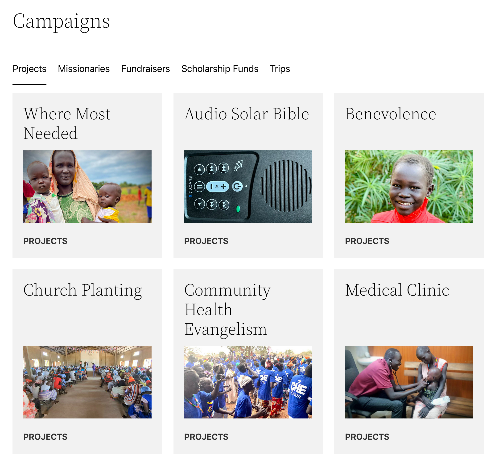

# Donately Integration

## Introduction

This is a WordPress plugin I'm working on publicly to integrate Donately more tightly into the website of a NGO I volunteer for. 

Features will be added to support that organization's specific needs but I'm trying to build everything so that it can be used by anyone and testing against a clean install of Twenty Twenty-Two (see screenshot below) in addition to that organization's website.

## Usage

1. Install this plugin by cloning or copying this repository to your wp-contents/plugins folder
2. Configure the required constants as explained below
3. Activate the plugin through the WordPress admin interface

## Configuring

### Constants

Define these in PHP – perhaps in your theme's [functions.php](https://developer.wordpress.org/themes/basics/theme-functions/#what-is-functions-php)

#### DONATELY_ID

*Required*

Your Donately account ID

#### DONATELY_TOKEN

*Required*

Your Donately API token

#### DI_TRANSIENT_EXPIRATION

*Optional*

How long API results from Donately are cached in WordPress (in seconds), default value is 1800 (30 minutes)

#### DI_CATEGORY_SEPERATOR

*Optional*

Since Donately doesn't have native support for categories, this plugin relies on prepending the name of your campaigns with their category. The default value for this constant is " - ". If you use this defaault value, you'd, for example, name your campaign "Projects - Medical Clinic".

#### DI_DONATELY_FEATURED

*Optional*

If you want a campaign to always appear first, define this constant with its id.

## Legal

This plugin is open-sourced software licensed under the GPL-3.0 license. 

I have no affiliation with Donately.